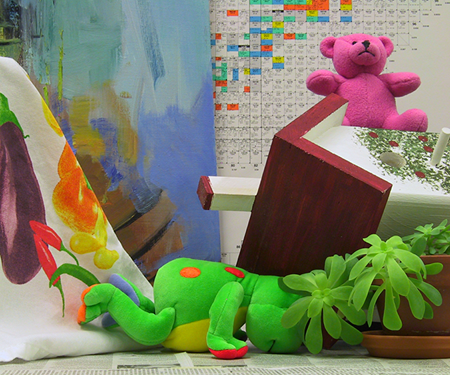

# Fast Stereo Disparity Estimator
MATLAB implementation of fast stereo disparity estimator.

# Disparity map
Try simple matlab [example](matlab/test.m).
```matlab
%% Input stereo pair of images
im_ol=rgb2gray(imread('images/left.png'));
im_or=rgb2gray(imread('images/right.png'));

%% Disparity filter
win=10;
max_dis=50;
weight=5;

tic;
im_dm = disparity_filter(im_ol, im_or, win, max_dis, weight);
toc;

%% Show result
figure(1);
imshow(im_dm);
title('disparity map');
```

<p align="center"></p>  
<p align="center"><b>Figure 1.</b> Stereo pair of images (left & right camera) and disparity map</p>  

Try it in [UMapx](https://github.com/asiryan/UMapx/blob/master/sources/Imaging/StereoDisparity.cs) - Cross-platform .NET library for digital signal processing. Fast and optimized.

# License
MIT
