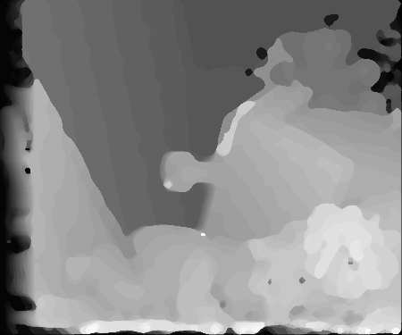

# Fast Stereo Disparity Estimator
MATLAB implementation of fast stereo disparity estimator.

# Disparity map

  

<b>Figure 1.</b> Stereo pair of images (left & right camera) and disparity map
  

# License
MIT
